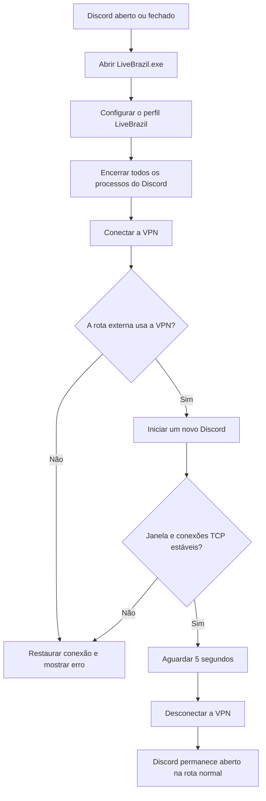

<div align="center">
  

  # LiveBrazil

  **Inicie uma nova sessão do Discord pela VPN e volte automaticamente para sua conexão normal.**

  [](#-requisitos)
  [](#-compilar-o-executável)
  [](#-testes)
  [](#)

  Desenvolvido por **[wnonynous](https://github.com/wnonynous)**
</div>

---

## ✨ O que é

O LiveBrazil é um launcher portátil para Windows que prepara uma conexão VPN nativa, encerra completamente uma sessão anterior do Discord e abre uma nova sessão pela rota da VPN. Depois que a janela e as conexões de rede do novo processo são confirmadas, a VPN é desligada e a rota normal é restaurada.

O projeto usa apenas **PowerShell, Node.js e recursos nativos do Windows**. Não utiliza WireGuard, Wintun, OpenVPN, Tailscale, Python ou um aplicativo Electron próprio.

### Principais recursos

| Recurso | Como funciona |
|---|---|
| 🚀 Inicialização automática | Basta abrir o `.exe`; não há botão inicial |
| 🪟 Interface compacta | Splash WPF sem moldura, inspirado no Discord |
| 🔐 VPN nativa | Perfil L2TP/IPsec criado pelo próprio Windows |
| 🔄 Reinício completo | Detecta processos do Discord mesmo quando o Windows oculta seus caminhos |
| 🌐 Rota confirmada | Verifica se o Windows realmente selecionou a interface VPN |
| 🧭 Sessão nova | Aceita somente processos criados depois da conexão VPN |
| 🛟 Recuperação | Tenta restaurar a rota normal mesmo quando alguma etapa falha |
| 📋 Diagnóstico | Registra apenas eventos operacionais em um log local |

## 🔁 Como funciona



O LiveBrazil não lê token, cookies, mensagens, DMs ou APIs privadas do Discord. A sessão é reconhecida por evidências locais: horário de criação do processo, janela principal e conexões TCP estabelecidas.

## 🧩 Componentes

| Componente | Local | Finalidade |
|---|---|---|
| Executável portátil | `helper/dist/LiveBrazil.exe` | Fluxo automático recomendado |
| Script standalone | `helper/standalone/LiveBrazil.ps1` | Interface WPF e automação Windows |
| Helper Node.js | `helper/src/` | API localhost e modo configurável |
| Script F12 | `discord-script/voiceroute.js` | Painel e diagnóstico manual dentro do Discord |

> [!NOTE]
> A pasta `dist/` não é versionada. O executável deve ser gerado localmente com `npm run build:exe` ou distribuído por uma release preparada pelo mantenedor.

## ✅ Requisitos

- Windows 10 ou Windows 11;
- Discord Stable instalado pelo instalador tradicional em `%LOCALAPPDATA%\Discord`;
- permissão para confirmar o UAC durante a criação da VPN;
- Node.js 18 ou superior somente para compilar ou usar o helper.

Instalações do Discord pela Microsoft Store, PTB e Canary não são suportadas pelo executável portátil nesta versão.

## 📦 Compilar o executável

```powershell
git clone https://github.com/wnonynous/livebrazil.git
cd livebrazil\helper
npm install
npm run build:exe
```

Resultado:

```text
helper/dist/LiveBrazil.exe
```

A build usa o **IExpress**, incluído no Windows, para incorporar o script PowerShell e o avatar em um único arquivo. O script interno recebe BOM UTF-8 para preservar corretamente os acentos no Windows PowerShell 5.1.

## ▶️ Usar o LiveBrazil

1. Feche ou salve qualquer trabalho importante no Discord.
2. Abra `LiveBrazil.exe`.
3. Confirme a solicitação do UAC.
4. Aguarde o splash concluir todas as etapas.
5. O splash fecha sozinho quando a rota normal é restaurada.

Se ocorrer uma falha, a interface permanece aberta e mostra **Tentar novamente**. O diagnóstico completo fica em:

```text
%LOCALAPPDATA%\LiveBrazil\status.log
```

## 🌏 Perfil VPN portátil

O executável cria ou atualiza automaticamente este perfil global:

| Campo | Valor |
|---|---|
| Provedor | Windows (interno) |
| Nome da conexão | `LiveBrazil` |
| Servidor | `public-vpn-109.opengw.net` |
| Protocolo | L2TP/IPsec com chave pré-compartilhada |
| Autenticação | MS-CHAPv2 com usuário e senha |
| Split tunneling | Desativado |

> [!WARNING]
> Esse é um servidor VPN público e operado por terceiros. Ele pode ficar indisponível e seu operador pode observar metadados e destinos de tráfego. As credenciais públicas estão incorporadas no executável e podem ser recuperadas por quem possuir o arquivo. Não reutilize esse modelo para credenciais privadas.

O LiveBrazil confirma que a interface VPN foi escolhida pelo Windows, mas não consulta um serviço externo de geolocalização para certificar o país do endereço IP.

## 🧰 Helper Node.js opcional

O helper oferece uma API restrita a `127.0.0.1` e um launcher configurável para uma VPN previamente cadastrada no Windows.

```powershell
cd helper
Copy-Item config\config.example.json config\config.json
npm install
npm start
```

Comandos disponíveis:

| Comando | Função |
|---|---|
| `npm start` | Inicia a API HTTP localhost |
| `npm run launch` | Executa o mesmo fluxo automático do `.exe` diretamente do código-fonte |
| `npm run launch:node` | Executa o launcher Node antigo para uma VPN previamente cadastrada |
| `npm run dev` | Inicia a API com recarga automática |
| `npm test` | Executa a suíte de testes |
| `npm run build:exe` | Gera o executável portátil |

Endpoints do helper:

| Método | Endpoint | Autenticação |
|---|---|---|
| `GET` | `/health` | Pública em localhost |
| `GET` | `/vpn/status` | Bearer token |
| `POST` | `/vpn/on` | Bearer token |
| `POST` | `/vpn/off` | Bearer token |

O token é gerado em `helper/data/auth-token.txt` e não deve ser compartilhado ou enviado ao Git.

## 🖥️ Painel F12 opcional

Com o helper ativo, o arquivo [`discord-script/voiceroute.js`](discord-script/voiceroute.js) pode ser colado manualmente no Console do Discord Desktop.

```javascript
await LiveBrazil.status();
await LiveBrazil.connect();
await LiveBrazil.disconnect();
await LiveBrazil.test();
LiveBrazil.panel.mount();
LiveBrazil.panel.refresh();
```

`VoiceRoute` permanece como alias de compatibilidade. O modo `LiveBrazil.auto(true)` pertence ao fluxo antigo por clique e não deve ser combinado com o executável, pois o script F12 desaparece quando o Discord é reiniciado.

## 🔒 Segurança

- servidor HTTP vinculado obrigatoriamente a `127.0.0.1`;
- token Bearer criptograficamente aleatório nas rotas VPN;
- nenhuma rota de shell, comando, PowerShell ou executável;
- nenhuma entrada arbitrária de nome de VPN, caminho ou comando pelo cliente;
- processos limitados à instalação do Discord e a nomes internos fixos;
- comandos nativos chamados com argumentos separados;
- nenhuma leitura de dados da conta Discord;
- tokens, configurações locais, logs, builds e caches ignorados pelo Git;
- tentativa de desconexão da VPN e restauração do Discord em caminhos de erro.

> [!IMPORTANT]
> O executável não possui assinatura Authenticode. Por isso, o Microsoft Defender SmartScreen pode exibir “Windows protegeu o computador”. Alterar metadados ou usar certificado autoassinado não cria confiança pública. Uma distribuição sem esse aviso exige assinatura reconhecida e reputação, ou publicação pela Microsoft Store.

## 🧪 Testes

```powershell
cd helper
npm test
```

Estado atual: **23 testes aprovados**.

A suíte cobre:

- conexão, confirmação e desconexão da VPN;
- mutex de operações concorrentes;
- erro de autenticação RAS 691;
- autenticação HTTP e política CORS;
- rejeição de entradas e endpoints perigosos;
- encerramento do Discord com caminhos ocultos;
- inicialização pelo shell normal do usuário;
- confirmação da rota VPN efetiva;
- detecção de uma nova sessão do Discord;
- splash automático, avatar e empacotamento UTF-8.

Build portátil validada:

| Propriedade | Valor |
|---|---|
| Formato | IExpress autoextraível |
| Tamanho aproximado | 731 KB |
| SHA-256 | `AA179D7B381F357A84632EDFAF38D1CBDB40386DA7E4B2BEB403BA623DD18478` |
| Assinatura | Não assinada |

O fluxo real não é executado pela suíte automatizada porque fecharia o Discord e alteraria a rota de rede da máquina. O parser PowerShell, o XAML e as regras operacionais são validados separadamente.

## 🩺 Solução de problemas

| Sintoma | Verificação |
|---|---|
| Discord não fecha | Procure `Processos do Discord detectados` no log; o launcher usa nomes fixos quando o caminho está oculto |
| VPN conecta, mas não vira rota principal | O fluxo para com `a rota padrão não foi aplicada` em vez de abrir o Discord fora da VPN |
| Erro RAS 691 | Confira usuário, senha, chave pré-compartilhada e disponibilidade do servidor público |
| Discord não inicia | Confirme a instalação Stable em `%LOCALAPPDATA%\Discord\Update.exe` |
| SmartScreen aparece | Comportamento esperado para uma build sem assinatura e sem reputação |
| Splash fica no erro | Consulte `%LOCALAPPDATA%\LiveBrazil\status.log` |

## ⚠️ Limitações

- não inspeciona o protocolo privado nem confirma o login interno da conta Discord;
- não garante a localização geográfica do IP sem consultar um serviço externo;
- depende da disponibilidade de uma VPN pública de terceiros;
- suporta somente a instalação tradicional do Discord Stable no modo portátil;
- exige UAC para criar uma conexão VPN global;
- pode haver renegociação de rede do Discord após a desconexão da VPN;
- o SmartScreen pode aparecer enquanto o executável permanecer sem assinatura confiável;
- o script F12 precisa ser colado novamente depois que o Discord é reiniciado.

## 📁 Estrutura

```text
VoiceRoute/
├── discord-script/
│   ├── README.md
│   └── voiceroute.js
├── helper/
│   ├── config/
│   ├── scripts/
│   ├── src/
│   ├── standalone/
│   ├── test/
│   ├── package.json
│   └── README.md
├── .gitignore
└── README.md
```

---

<div align="center">
  <strong>LiveBrazil</strong><br>
  Windows • VPN nativa • Discord Desktop<br><br>
  <a href="https://github.com/wnonynous/livebrazil/issues">Relatar um problema</a>
</div>
